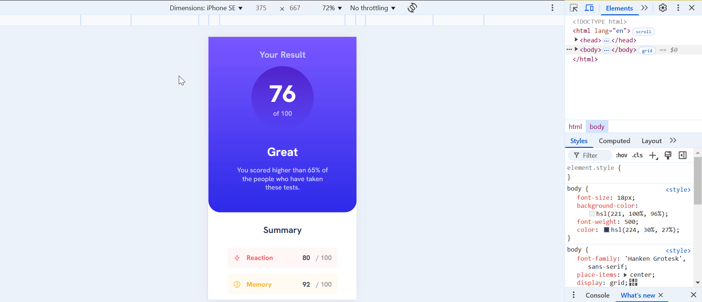

# Frontend Mentor - Results summary component solution

This is a solution to the [Results summary component challenge on Frontend Mentor](https://www.frontendmentor.io/challenges/results-summary-component-CE_K6s0maV). Frontend Mentor challenges help you improve your coding skills by building realistic projects.

## Table of contents

- [Overview](#overview)
  - [The challenge](#the-challenge)
  - [Screenshot](#screenshot)
  - [Links](#links)
- [My process](#my-process)
  - [Built with](#built-with)
  - [What I learned](#what-i-learned)
  - [Continued development](#continued-development)
  - [Useful resources](#useful-resources)
- [Author](#author)

## Overview

### The challenge

Users should be able to:

- View the optimal layout for the interface depending on their device's screen size
- See hover and focus states for all interactive elements on the page
- **Bonus**: Use the local JSON data to dynamically populate the content

### Screenshot



### Links

- Solution URL: [Add solution URL here](https://your-solution-url.com)
- Live Site URL: [Add live site URL here](https://your-live-site-url.com)

## My process

### Built with

- Vite
- [React](https://reactjs.org/) - JS library
- [Styled Components](https://styled-components.com/) - For styles
- Flexbox

### What I learned

I learned how to scaffold a project using Vite:

```bash
npm create vite@latest
```

I learned how to write css in ts file by using `styled-components`

I learned how to add global styles using `createGlobalStyle` from `styled-components`

I learned how to setup a theme using `styled-components`:

```ts
export const theme = {
 colors: {
  lightRed: "hsl(0, 100%, 67%)",
  orangeyYellow: "hsl(39, 100%, 56%)",
  greenTeal: "hsl(166, 100%, 37%)",
  cobaltBlue: "hsl(234, 85%, 45%)",
  lightSlateBlueBackground: "hsl(252, 100%, 67%)",
  lightRoyalBlueBackground: "hsl(241, 81%, 54%)",
  violetBlueCircle: "hsla(256, 72%, 46%, 1)",
  persianBlueCircle: "hsla(241, 72%, 46%, 0)",
  white: "hsl(0, 0%, 100%)",
  paleBlue: "hsl(221, 100%, 96%)",
  lightLavender: "hsl(241, 100%, 89%)",
  darkGrayBlue: "hsl(224, 30%, 27%)",
  lightGrayBlue: "hsl(224, 30%, 27%, 0.5)",
  lightRedBg: "hsla(0, 100%, 67%, 0.05)",
  orangeyYellowBg: "hsla(39, 100%, 56%, 0.05)",
  greenTealBg: "hsla(166, 100%, 37%, 0.05)",
  cobaltBlueBg: "hsla(234, 85%, 45%, 0.05)",
 },
 fontSizes: {
  base: "18px",
 },
 fontWeights: {
  base: 500,
  bold: 700,
  bolder: 800,
 },
};
```

```ts
import "styled-components";

declare module "styled-components" {
 export interface DefaultTheme {
  colors: {
   lightRed: string;
   orangeyYellow: string;
   greenTeal: string;
   cobaltBlue: string;
   lightSlateBlueBackground: string;
   lightRoyalBlueBackground: string;
   violetBlueCircle: string;
   persianBlueCircle: string;
   white: string;
   paleBlue: string;
   lightLavender: string;
   darkGrayBlue: string;
   lightGrayBlue: string;
   lightRedBg: string;
   orangeyYellowBg: string;
   greenTealBg: string;
   cobaltBlueBg: string;
  };
  fontSizes: {
   base: string;
  };
  fontWeights: {
   base: number;
   bold: number;
   bolder: number;
  };
 }
}
```

```tsx
import { GlobalStyles } from "./globalStyles";
import { ThemeProvider } from "styled-components";
import { theme } from "./theme";

function App() {
 return (
  <ThemeProvider theme={theme}>
   <GlobalStyles />
   <StyledContainer>
    <ResultContainer />
    <MarksContainer />
   </StyledContainer>
  </ThemeProvider>
 );
}

export default App;
```

I learned how to create mixins using `styled-components`:

```ts
import { css } from "styled-components";

export const tablet = (styles: TemplateStringsArray) => css`
  @media (max-width: 768px) {
    ${styles}
  }
`;

export const mobile = (styles: TemplateStringsArray) => css`
  @media (max-width: 480px) {
    ${styles}
  }
`;
```

I learned how to add gradient background:

```ts
export const StyledResultContainer = styled.div`
    display: flex;
    flex-direction: column;
    align-items: center;
    justify-content: space-between;
    gap: 1rem;
    padding: 2rem;
    border-radius: 2rem;
    width: 25rem;
    background-image: linear-gradient(
    ${({ theme }) => theme.colors.lightSlateBlueBackground},
    ${({ theme }) => theme.colors.lightRoyalBlueBackground}
  );
    color: ${({ theme }) => theme.colors.lightLavender};

    ${mobile`
        border-radius: 0 0 2rem 2rem;
      `}
`;
```

I learned how to create React Hook for fetching data:

```ts
import { useEffect, useState } from "react";
import type { MarksData } from "../../types";

const useFetchMarks = () => {
    const url = "/data.json";
 const [marks, setMarks] = useState<MarksData[]>([]);
 const [loading, setLoading] = useState<boolean>(true);
 const [error, setError] = useState<string | null>(null);

 useEffect(() => {
  const fetchMarks = async () => {
   try {
    const response = await fetch(url);
    if (!response.ok) {
     throw new Error(`HTTP error! status: ${response.status}`);
    }
    const result = await response.json();
    setMarks(result);
   } catch (error) {
    setError(error instanceof Error ? error.message : "An error occurred");
   } finally {
    setLoading(false);
   }
  };

  fetchMarks();
 }, []);

 return { marks, loading, error };
};

export default useFetchMarks;
```

### Continued development

I would continue practicing creating & customizing styled-components in React.

### Useful resources

- [Scaffolding Your First Vite Project](https://vite.dev/guide/#scaffolding-your-first-vite-project) - This helped me setup my 1st Vite + React project
- [CSS Gradients](https://www.w3schools.com/css/css3_gradients.asp) - This helped me create the required gradient effect
- [Theming in Styled Components](https://styled-components.com/docs/advanced#theming) - This helped me in creating a custom theme for my project

## Author

- Frontend Mentor - [@snigdha-sukun](https://www.frontendmentor.io/profile/snigdha-sukun)
